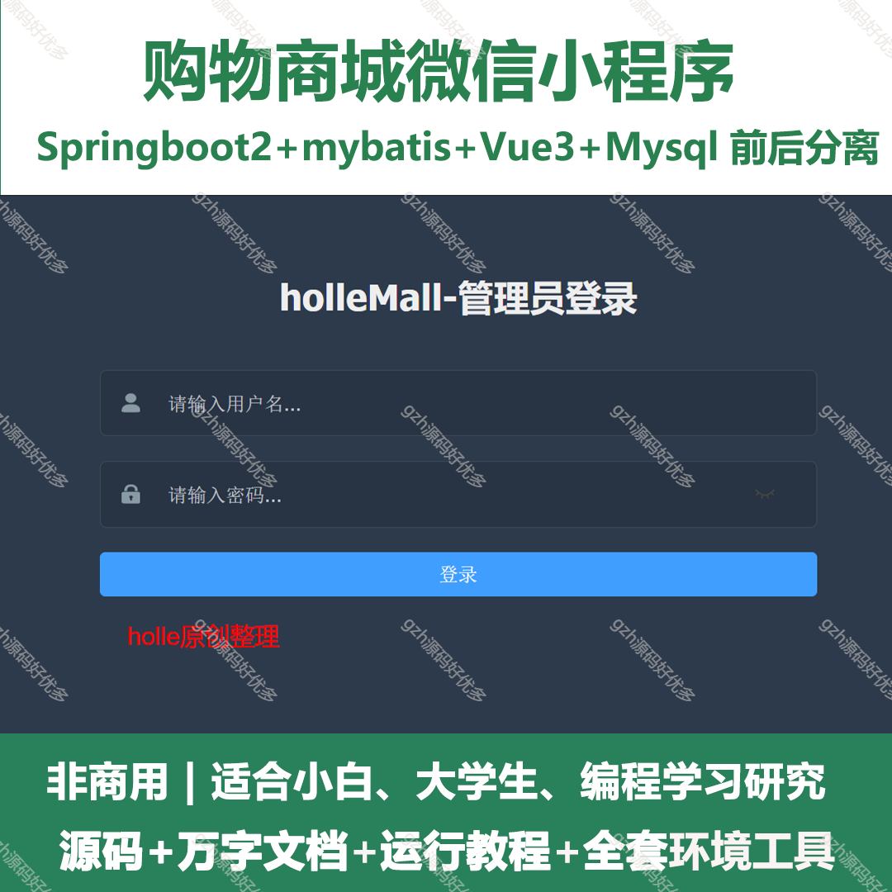
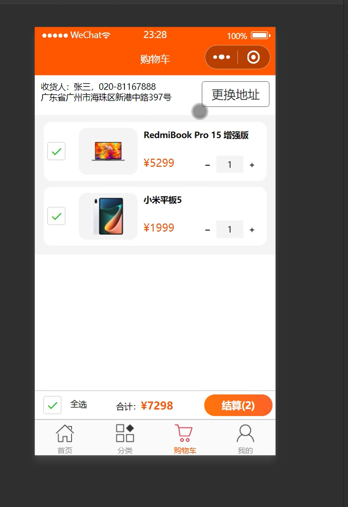
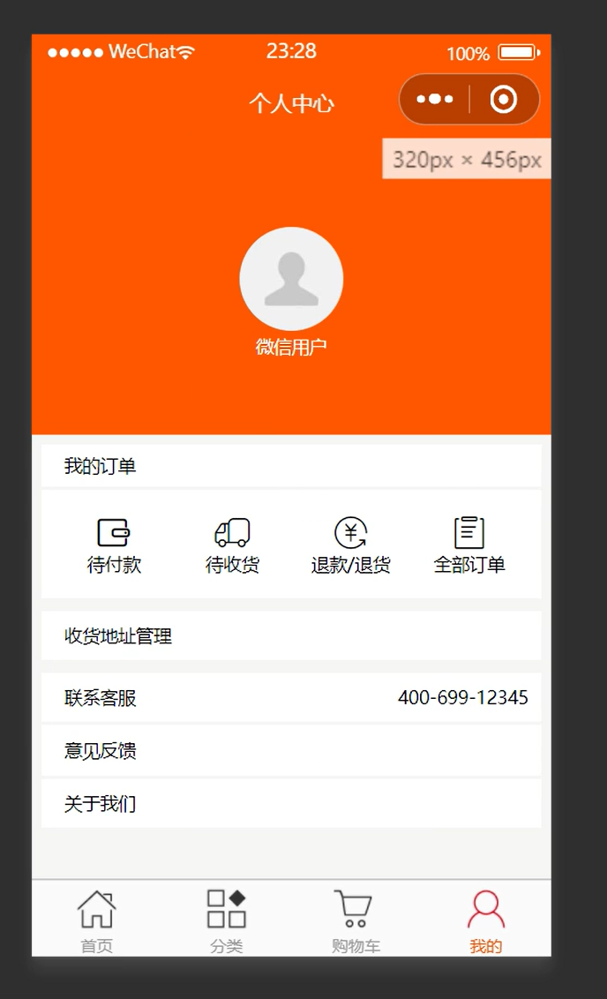
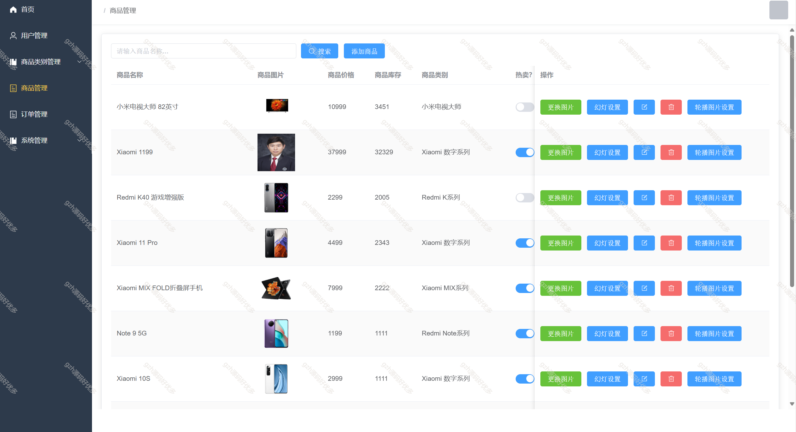
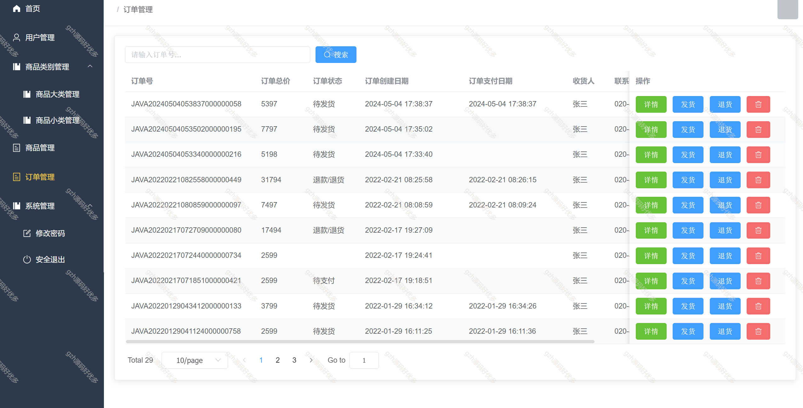
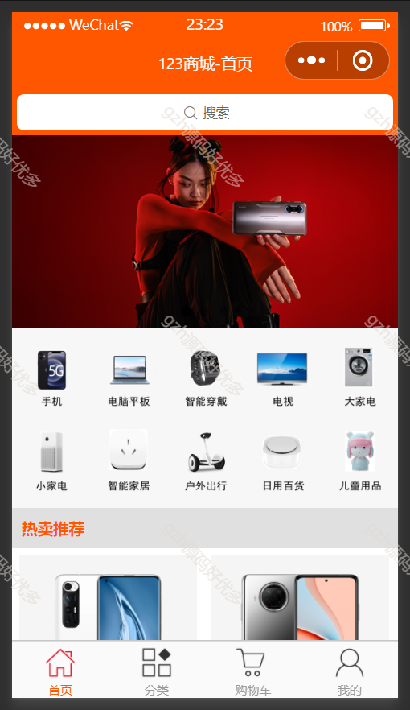
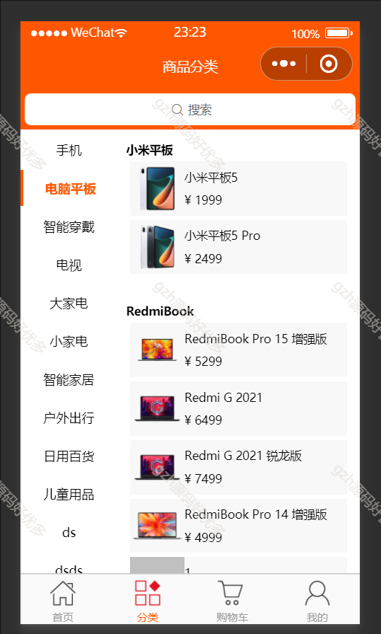
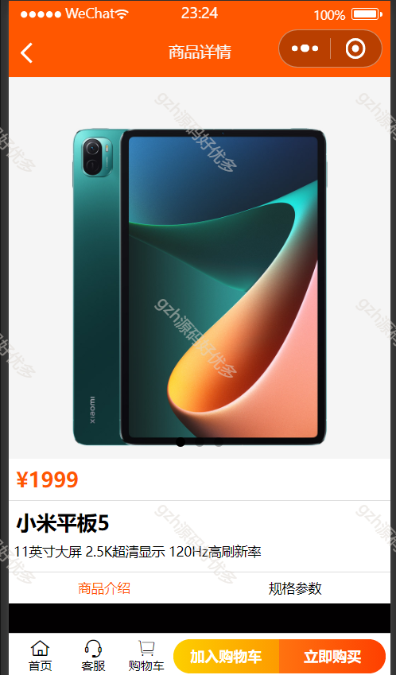
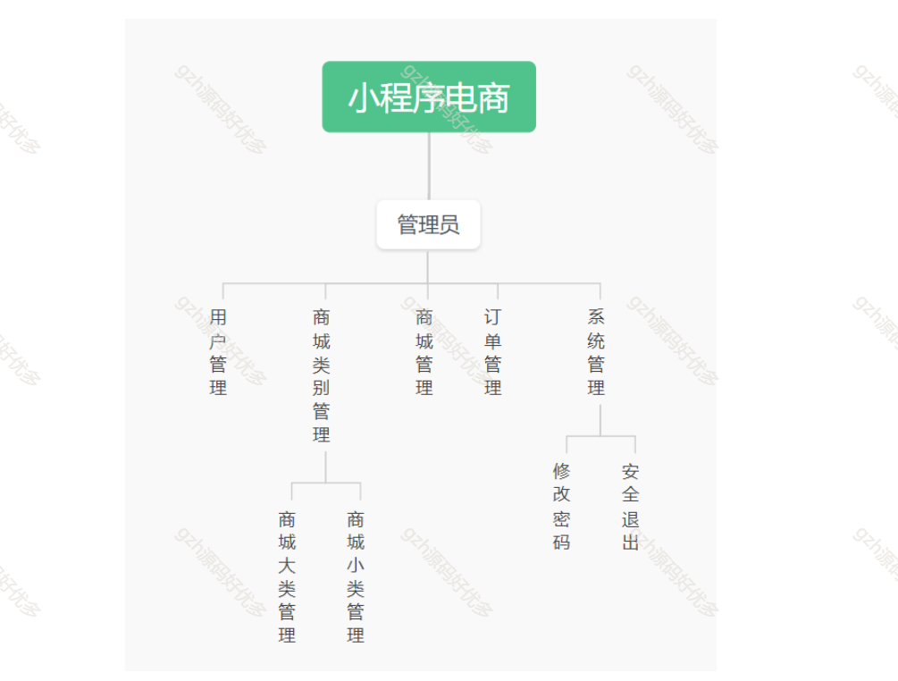

# mpweixinA078
mpweixinA078购物商城微信小程序
 
## 查看主页获取源码

### 一、关键词

商城购物小程序，商城购物系统，商城购物管理系统

 

### 二、作品包含

源码+数据库+万字文档+全套环境和工具资源+部署教程

 

### 三、项目技术

前端技术： vue3 Element Plus Axios Echarts
后端技术：Java、SpringBoot2.0、MyBatis

  

 

### 四、运行环境（以下版本亲测，其他版本未知，请自测）

开发工具：IDEA/eclipse  + VSCODE + 微信开发者工具

数据库：MySQL8

数据库管理工具：Navicat10以上版本

环境配置软件： JDK1.8 + Maven3.6.3

前端Nodejs：16

浏览器：谷歌浏览器

 

### 五、项目介绍

项目编号：mpweixinA078

随着信息技术在管理上越来越深入而广泛的应用，管理信息系统的实施在技术上已逐步成熟。本文介绍了微信小程序商城系统的开发全过程。通过分析微信小程序商城系统管理的不足，创建了一个计算机管理微信小程序商城系统的方案。文章介绍了微信小程序商城系统的系统分析部分，包括可行性分析等，系统设计部分主要介绍了系统功能设计和数据库设计

本小程序商城系统有管理员，用户两种角色。
(1)管理员：用户管理、商品类别管理、商品管理、订单管理、系统管理。
(2)用户：首页商品展示、商品分类、购物车、下单结账、我的信息。

 

### 六、运行截图

